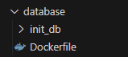
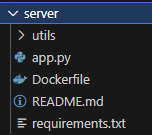
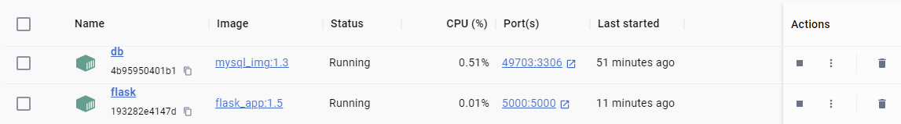
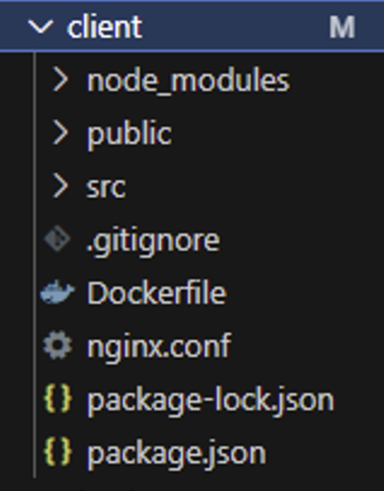
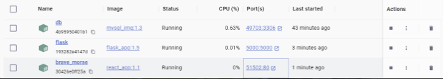
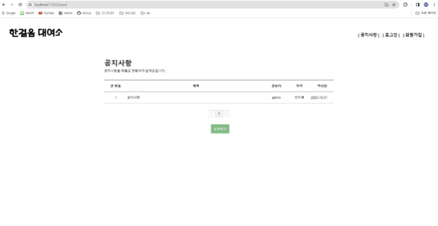

# Docker

## MySQL



**데이터베이스 초기값**

MySQL Workbench에서 Data Export한다. (init_db)

```docker
FROM mysql
ENV MYSQL_ROOT_PASSWORD=root
ENV MYSQL_DATABASE=firststep
ADD ./init_db/* /docker-entrypoint-initdb.d
```

```bash
// network생성
docker network create --driver=bridge net
//mysql 이미
docker image build -t mysql_img:1.3 .
docker container run -d -v db:/var/lib/mysql -p 3306 --net=app-network --name db mysql_img:1.3
```

## Flask



[server.py](http://server.py) → app.py로 파일명 변경

- flask는 default가 app.py여서 변경하였다.

```bash
pip install flask
pip install pymysql
pip install passlib
pip install cryptography
pip install flask-cors
pip freeze > requirements.txt
```

```python
# 데이터 베이스 연결
def getCon():
  return pymysql.connect(host="db", 
                     user="root", password="password", 
                     db="firststep",
                     charset="utf8",
                     cursorclass=pymysql.cursors.DictCursor)
```

```docker
FROM python
FROM python
WORKDIR /myapp
COPY . .
RUN pip install -r requirements.txt
CMD [ "python", "-m", "flask", "run", "--host=0.0.0.0" ]
```

```bash
docker image build -t flask_app:1.5 .
docker container run -d -p 5000 --net=app-network --name flask flask_app:1.5
```

## MySQL + FLASK




## React



```docker
FROM    node AS builder
RUN     mkdir /myapp
WORKDIR /myapp
COPY    package.json .
RUN     npm install
COPY    . .
RUN     npm run build

FROM    nginx AS runtime
COPY    --from=builder /myapp/build /usr/share/nginx/html/
RUN     rm /etc/nginx/conf.d/default.conf
COPY    nginx.conf /etc/nginx/conf.d
CMD     [ "nginx", "-g", "daemon off;" ]
```

```docker
docker image build -t react_app:1.0 .
docker container run -d -p 80 react_app:1.1
```

## 결과


